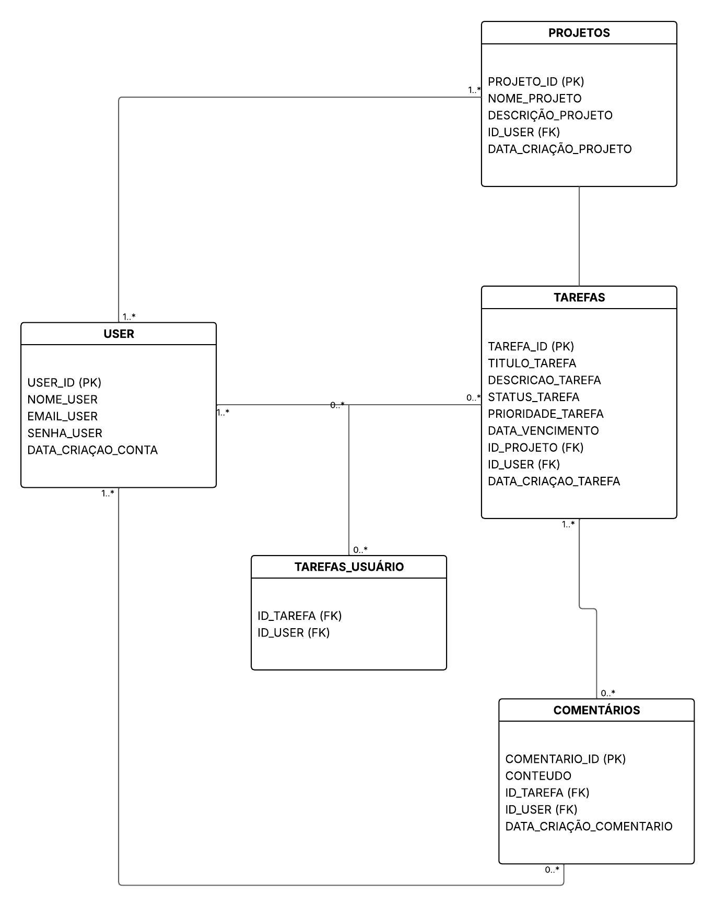
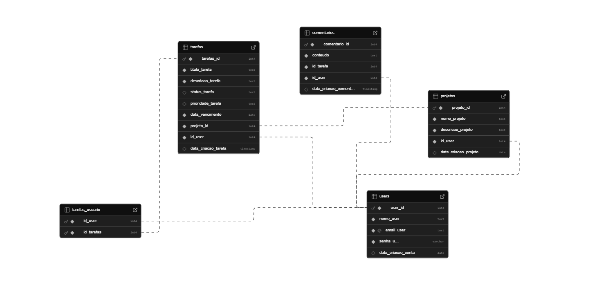

# Introdução

Um gerenciador de tarefas é uma ferramenta utilizada para gerir projetos em equipe e de cunho individual com relação a prioridade e tempo. Este tipo de ferramenta é fundamental para organização e mediação de trabalhos, sendo recomendada para pessoas que participam de projetos e precisam realizar a divisão correta de tarefas e atribuições.

Segundo uma pesquisa realizada pela ONG Junior Achievement (JA) Brasil em 2024, cerca de 61,9% dos jovens não realizam ou não sabem realizar gestão de terafas, um problema que só tem crescido ultimamente entre a população. Um caso preocupante ao pensar nos futuros líderes do país e do mundo. Infelizmente, esta realizade se dá muitas vezes por conta da falta de uma ferramenta que seja intuitiva e simples para que os usuários não se percam em suas funcionalidades.

Neste contexto surge a Pomodorganiza, a ferramenta de gerenciamento de tarefas que promete organização e produtividade ao usuário, contanto com uma interface clara e objetiva, proporcionando o engajamento dos usuários e melhor gestão de sua vida profissional e pessoal.

# Modelo lógico e modelo físico do banco de dados

O modelo lógico do banco de dados foi criado com o objetivo de proporcionar melhor visualização e planejamento ao projeto que está sendo desenvolvido, proporcionando assim um planejamento objetivo em realação aos elementos (tabelas, variáveis, etc.) presentes no banco de dados do projeto.


Autora: Alessandra Nascimento Santos Sena
Framework: LucidChart

Como pode ser visto neste modelo lógico do Pomodorganiza, foram criadas 5 tabelas ao total para armazenar itens importantes da plataforma de gerenciamento de tarefas. Para sinalizar as chaves primárias de cada tabela, foi utilzado a abreviação PK (Primary Key) para melhor identificação dos desenvolvedores do banco. Para sinalizar as chaves estrangeiras foi feito o mesmo, utilizamos a abreviação FK (Foreign Key) para que fossem facilmente identificadas. Também foram adicionadas as cardialidades em cada conexão entre as tabelas, indicando o relacionamento entre elas.

Após esta organização prévia, podemos enfim contruir as tabelas dentro do banco de dados, nos baseando no que foi planejado ao realizar o modelo lógico. A prática desta nova criação é o modelo físico do nosso banco, que ao ser finalizado se mostra da seguinte forma:

``` sql


createtable USERS(

  user_id SERIAL primary key,

  nome_user text not null,

  email_user text unique not null,

  senha_user varchar(8) not null,

  data_criacao_conta date default current_date

);

createtable PROJETOS(

  projeto_id SERIAL primary key,

  nome_projeto text not null,

  descricao_projeto text not null,

  id_USER int not null,

  constraint fk_usuario foreign key (id_USER)references USERS(user_id),

  data_criacao_projeto date default current_date

);

createtable TAREFAS(

  tarefas_id serial primary key,

  titulo_tarefa text not null,

  descricao_tarefa text not null,

  status_tarefa text check(status_tarefa in('pendente','em andamento','concluído'))default'pendente',

  prioridade_tarefa text check(prioridade_tarefa in('baixa','media','alta'))default'baixa',

  data_vencimento date notnull,

  projeto_id int notnull,

  id_USER int notnull,

  data_criacao_tarefa timestamp default current_timestamp,

  constraint fk_projeto foreign key (projeto_id)references PROJETOS(projeto_id),

  constraint fk_usuario foreign key (id_USER)references USERS(user_id)

);

createtable COMENTARIOS(

  comentario_id serial primary key,

  conteudo text not null,

  id_tarefa int not null,

  id_USER int not null,

  constraint fk_tarefa foreign key (id_tarefa)references TAREFAS(tarefas_id),

  constraint fk_user foreign key (id_USER)references USERS(user_id),

  data_criacao_comentario timestamp default current_timestamp

);

createtable TAREFAS_USUARIO(

  id_USER int not null,

  id_tarefas int not null,

  primary key (id_USER, id_tarefas),

  constraint fk_user foreign key (id_USER)references USERS(user_id),

  constraint fk_tarefas foreign key (id_tarefas)references TAREFAS(tarefas_id)

);
```
Com a criação das tabelas, o modelo físico é criado e assim podemos visualizar a estrutura final do banco de dados: 


Autora: Alessandra Nascimento Santos Sena
Framework: Supabase

